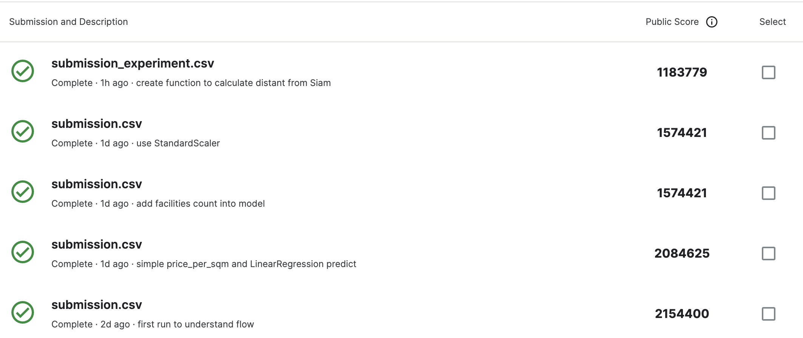
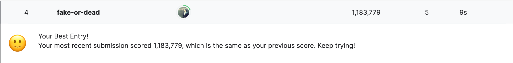

# project 2 Bangkok housing Price
https://www.kaggle.com/competitions/dsi-tda-03-project-2/leaderboard


## Prerequisite
- python 3.11


## Though Process
First I try to analysis as normal people that knew about housing price about nature of data since land price depend on location 
- that bangkok and urban is different price also remote from bangkok (in this case is much more lower)
- categorize Accommodation by `property_type`

| property_type  |        amount |
|----------------|---------------|
| Condo          |       9206    |
| Detached House |       2169    |
| Townhouse      |       2896    |


normally each accommodation have their own characteristics eg.
- Condo didn't have area but floor area also unit to multiply to resident that can calculate true cost of Condo
- Detached and TownHose may vary a bit in term of business opportunity will investigate more

```
land area and floor area may use different unit?
floor_area maybe m2
land_area maybe wa2
```
`got confirmed that all use sqm unit!`

need to calculate new column `price_per_area` unit for leverage 

## Data Modelling Process


### First round : init and learn to submit to kaggle
```
just run and learn to submit result to kaggle
```

### Second: simple calculate `price_per_sqm` without recheck data
`Found out that cannot use price to EDA information since test data need us to predict price `

### Third tries
so I sum all `facilities` list into amount (int)
and categorize `province` furthermore


### Forth tries
split `facilities` list into column got training score better to almost .5
```
R2 Score of train : 0.49728222673000055
R2 Score of dev   : 0.5338534660986683

RMSE of train : 1541491.1404284884
RMSE of test  : 1503814.7436284455
```

also use `StandardScaler` but found out that no significant changed (or maybe upload wrong file)

### Fifth tries
add `district` to categorize column
```
R2 Score of train : 0.6062508250477749
R2 Score of dev   : 0.6258658662603769

RMSE of train : 1364233.5996518398
RMSE of test  : 1347245.6032644354
```

### Sixth EDA `total_units` fillna to 1
```
R2 Score of train : 0.6086794248367495
R2 Score of dev   : 0.6300410795617861

RMSE of train : 1360019.8739041835
RMSE of test  : 1339707.104599003
```

### 7th fillna `baths` and `bedrooms` to mean
```
R2 Score of train : 0.6602961313781012
R2 Score of dev   : 0.6819803878806854

RMSE of train : 1267153.3016987476
RMSE of test  : 1242110.0065649434
```

### 8th adding mean `floor_area` for each `property_type`
```
R2 Score of train : 0.6714050494778212
R2 Score of dev   : 0.6916398938678203

RMSE of train : 1246262.0079748235
RMSE of test  : 1223100.664110882
```

### Experiment that use all mean to every value missing is leading to?
- approach1 fix 0, 1 fillna by instinct
```
R2 Score of train : 0.6719100690645174
R2 Score of dev   : 0.6918508955767362

RMSE of train : 1245303.945873947
RMSE of test  : 1222682.1266788612
```

- approach 2 fillna by mean
```
R2 Score of train : 0.6718715070965445
R2 Score of dev   : 0.6908790009017531

RMSE of train : 1245377.1269675856
RMSE of test  : 1224608.7633689619
```

Dont know what to do follow Lab pattern or by mean ;__;

### experiment 2 Distant to Siam
create function to calculate distant from Siam
https://maps.app.goo.gl/E954o1rAdTKxDHyG6

```
def distant_to_siam(lat, long):
    siam_lat = 13.7465
    siam_long = 100.532
    return np.sqrt((lat - siam_lat)**2 + (long - siam_long)**2)
```
then 
```
R2 Score of train : 0.6753565984224819
R2 Score of dev   : 0.6952693456667456

RMSE of train : 1238745.8235108226
RMSE of test  : 1215881.3047404697
```

and yeah this is my best version
